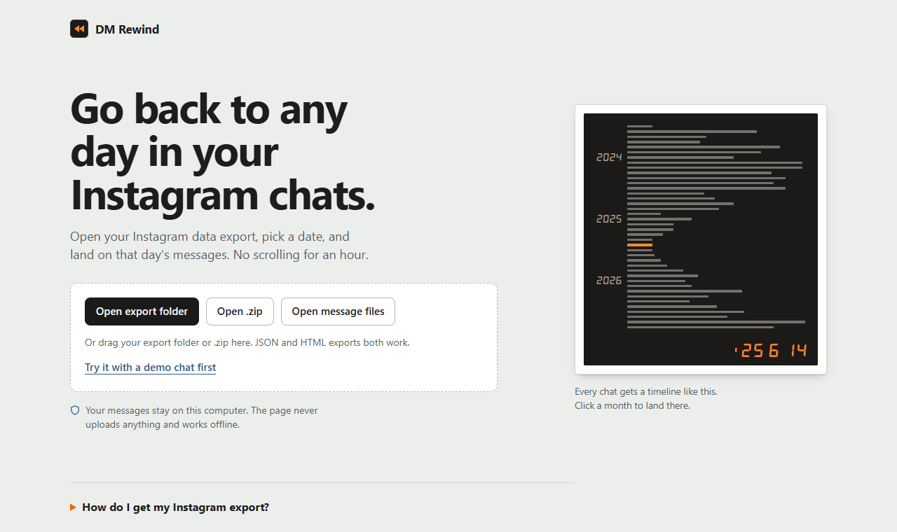
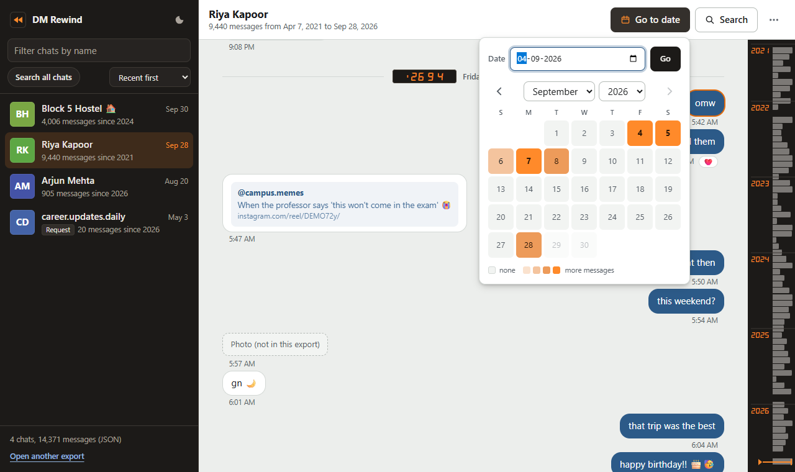
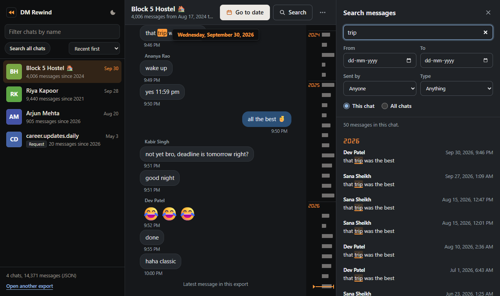
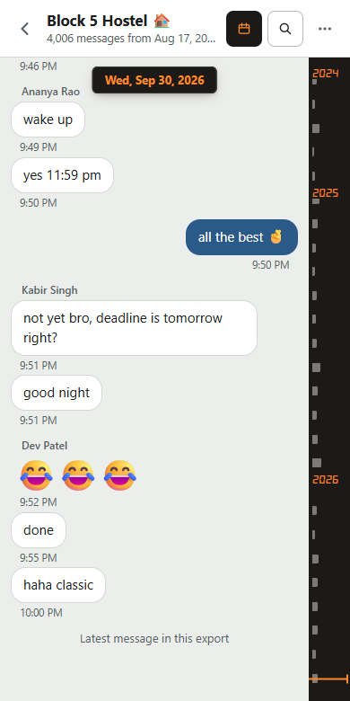

# DM Rewind

Jump to any date in your Instagram DMs without scrolling for an hour.



DM Rewind is a small offline web app that opens your Instagram data export (JSON **or** HTML) and lets you:

- **Go to a date.** Pick a day and land on the first message from it. If nothing was sent that day, it takes you to the closest day that has messages and tells you so.
- **Browse a calendar heatmap.** Each month's calendar is shaded by how many messages were sent each day. Click a day to go there.
- **Scrub the month rail.** The bar on the right of every chat shows how many messages were sent each month. Click or drag it to move through the whole chat.
- **Search.** Look up words or an exact `"phrase"`, filtered by date range, sender, and type (photos, videos, voice messages, links/shared posts, calls, reacted-to). Search one chat or all of them.
- **See this day in past years.** Shows messages from today's date in earlier years.
- See photos, videos and voice messages inline when they're in the export, plus reactions and shared posts.

Everything runs in your browser. Nothing is uploaded and no network requests are made, so it works offline.

| Go to date + month rail | Search (dark) | Phone |
|---|---|---|
|  |  |  |

*Screenshots use the built-in demo chat, which is made-up data.*

## Run it

No install and no build step. Open `index.html` in Chrome, Edge, Brave or Firefox (double-click it).

Then click one of these:

| Button | Use it for |
|---|---|
| **Open export folder** | The unzipped export folder. Best for big exports. |
| **Open .zip** | The .zip file exactly as Instagram sent it. |
| **Open message files** | One or more `message_1.json` / `message_1.html` files from a single chat folder. |

You can also drag a folder or .zip onto the page, or click **Try it with a demo chat first** to see how it works with made-up data.

> When you open a folder, Chrome may ask "Upload N files to this site?". That's the browser's standard wording for giving a page access to a folder. The page only reads the files on your computer; nothing is sent anywhere.

## Getting your Instagram export

1. Instagram → **Settings** → **Accounts Center** → **Your information and permissions**.
2. **Export your information** (older versions call it **Download your information**) → create an export for your Instagram profile.
3. **Export to device** → **Customize information** → keep only **Messages** (this makes the export smaller and faster).
4. Date range **All time**. Format **JSON** (exact timestamps) or **HTML** (both work).
5. Download the .zip when Instagram emails you, then open it in DM Rewind.

Exports don't include unsent or disappearing messages. If a chat is missing, it may be end-to-end encrypted; Instagram leaves those out of the standard export.

## Keyboard shortcuts

| Key | Action |
|---|---|
| `g` | Go to date |
| `/` | Search this chat |
| `Home` / `End` | First / latest message (when the chat has focus) |
| `Esc` | Close the open panel |
| Arrow keys | Move between days in the calendar, or between chats in the list |

## Look and feel

The design idea is the orange date a disposable camera burns into the corner of a print (`'26 9 16`). Each day in a chat gets that imprint, the chat list and the month rail sit on a dark "camera body", and your messages are print-back blue on photo-paper white.

- Light and dark themes (follows your system, with a toggle in the sidebar).
- Works at phone width.
- Motion is limited to four moments: the ring when you land on a message, the Go to date popover opening, the month-rail marker moving, and the search panel sliding in. `prefers-reduced-motion` turns the movement into plain fades, and the keyboard shortcuts skip it.
- Aimed at WCAG 2.2 AA: visible focus, keyboard access, and text contrast of at least 4.5:1.

Product notes (who it's for, tone, principles) are in [PRODUCT.md](PRODUCT.md).

## Project layout

```
DM Rewind/
├── index.html          App shell and markup
├── css/style.css       Styles (light + dark, responsive, design tokens at the top)
├── js/parser.js        Reads JSON/HTML exports into one sorted list per chat
├── js/sources.js       Opens folders, .zip files, loose files and drag-and-drop
├── js/demo.js          Generates the demo export
├── js/app.js           UI: chat list, timeline, month rail, calendar, search
├── vendor/zip.min.js   zip.js 2.22 (BSD-3-Clause), for opening .zip exports
├── licenses/           Licence text for bundled third-party pieces
├── docs/               Screenshots used in this README
└── PRODUCT.md          Product notes
```

### How it works

- **JSON exports** write UTF-8 text as Latin-1 escapes, so emoji show up as `ð\x9f\x98\x82`. `fixText()` in `parser.js` converts it back without touching text that's already correct.
- **HTML exports** are parsed with `DOMParser`. Message blocks are found by Instagram's current class names, with a fallback that looks for any block ending in a timestamp, so small format changes don't break it. HTML timestamps only go to the minute, so messages with the same time keep the order they had in the file.
- Every chat folder can have several `message_N` files (newest first). They're merged and sorted oldest to newest. Exact duplicates are dropped, and if a chat has both JSON and HTML files, the JSON is used.
- **Your name** comes from `personal_information.json` when it's present. Otherwise it's the name that appears in the most chats, or, in one-to-one chats, the person who isn't the chat's title. You can change it from the **⋯** menu in any chat.
- **The timeline is windowed.** Only about 700 messages are on the page at once, and more load as you scroll, so chats with 100,000+ messages stay smooth. Jumping to a date uses a binary search over timestamps. A 100,000-message test chat loads in well under a second and jumps in a few milliseconds.
- **Media is matched by file name** against the export (with the folder path used as a tiebreaker) and loaded only when it scrolls into view.

## Working on it

There's no build, so edit the files and refresh the page. A few things worth knowing:

- Colours, spacing and fonts are CSS variables at the top of `css/style.css`; the light and dark themes are two sets of the same variables.
- `js/app.js` finds elements by id and `data-` attribute (`#rail`, `.slot[data-k]`, `#calGrid button[data-day]`, `.msg[data-i]`, and so on), so keep those when changing the markup.
- Never commit a real export. `.gitignore` already skips `.zip` files and `message_*.json` / `message_*.html`.
- The tooling folders for the AI design skills I used (`.claude/`, `.impeccable/`, `skills-lock.json`) are git-ignored. You don't need any of it to run or change the app.

## Credits

- [zip.js](https://gildas-lormeau.github.io/zip.js/) 2.22 in `vendor/` (BSD-3-Clause).
- The imprint digits are a tiny subset of [DSEG](https://github.com/keshikan/DSEG) 7 Classic Bold Italic by keshikan, embedded in `css/style.css` (SIL Open Font License 1.1, see `licenses/DSEG-OFL.txt`).

## Ideas for later

- Export a date range as a PDF or text file
- Stats per chat: messages per person, busiest hours, longest streak
- Remember the last chat and position you had open
